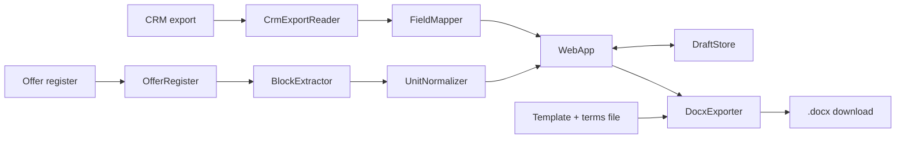
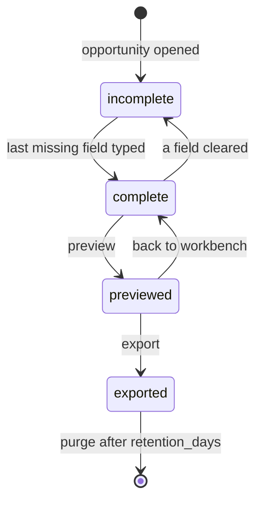

<!-- Example — fictitious Example GmbH. Shows what a finished file looks like; not a template. -->

# OFA Concept — Consolidated Requirements

_Sections 0–12 of the MANIFEST document structure. Together with `30-synthesis.md` (Sections 13–16) this is the source of truth for the feature's code: a fresh agent, given only these files and `CONTEXT.md`, must be able to regenerate the implementation. IDs carry the feature code (`F-OFA-1`) and never change after `done`; reruns append, never renumber._

## 0. Synthesis Context

- **Development path:** mixed — flow, 19-field list, origin pattern and preview retrofitted from the maquette (restated here, not referenced); the rest frontloaded.
- **Synthesis dependencies:** none — OFA is the first feature.
- **Synthesis scope:** the whole feature, from this document, `CONTEXT.md` and `decisions/ADR-OFA-001…003`. The maquette's 19-field list with its CRM column mapping is restated in §10.
- **Field of application:** internal web app (document assistant) — `checklists/requirements.md` Cross-Cutting, Web application, Technology.

## 1. Purpose

"Our engineers spend two hours per offer copying data and hunting for old offers, so customers wait three days for a quote." A sales engineer turns a CRM opportunity into a complete, checkable offer draft in minutes, with every value showing where it came from.

## 2. Ubiquitous Language & Context

<!-- Delta only. The brief's terms (opportunity, offer draft, offer field, origin tag, missing field, text block, pump series, workbench, origin count) are already in CONTEXT.md unchanged. -->

| Term | Meaning | Used in code as |
| --- | --- | --- |
| offer register | Sales ops' list of sent offers: number, date, customer, series, file path | `OfferRegister` |
| terms file | The current standard terms, owned by Legal; never taken from earlier offers | `TermsFile` |
| price placeholder | The empty price section the engineer fills from the ERP quotation | `PRICE_PLACEHOLDER` |
| origin | `crm` · `earlier_offer` · `typed` | `Origin` |

## 3. Functional Requirements

| ID | Requirement | Acceptance (falsifiable) | Origin | Evidence |
| --- | --- | --- | --- | --- |
| F-OFA-1 | List open opportunities with customer, pump series, quantity, stage | Fixture export with 6 open, 2 closed → 6 rows, sorted by creation date | cF-1 | [evidenced] |
| F-OFA-2 | Prefill offer fields from the CRM record with origin `crm` | OPP-104 fixture → the 16 mapped fields filled, each tagged `crm` | cF-2, intake #1 | [evidenced] |
| F-OFA-3 | Flag fields with no column or an empty value as missing | Record with empty delivery address → 4 missing (3 unmapped + address) | cF-3, intake #1, #3 | [evidenced] |
| F-OFA-4 | Suggest text blocks ("Scope of supply", "Technical notes") from offers of the same pump series sent in the last 36 months | P-80 opportunity → only P-80 blocks from register rows ≤ 36 months; none from other series | cF-4, GR-7, OQ-2, OQ-3 | [evidenced]; extraction rule [unknown] — OQ-13 |
| F-OFA-5 | Preview shows all sections and the origin count | "16 from CRM · 3 typed · 2 blocks reused" for the S3 scenario | cF-5 | [evidenced] |
| F-OFA-6 | Each suggested block shows its offer number and date | Block card shows both, equal to the register row | cF-6 | [evidenced] |
| F-OFA-7 | Export a Word document on the current offer template | File opens in the company word processor; template styles unchanged | cF-7, OQ-7, OQ-9 | [evidenced] |
| F-OFA-8 | Convert flow rates in l/s to m³/h before reuse (× 3.6) | Block "12.5 l/s" → "45.0 m³/h" | cF-8, OQ-11 | [evidenced] |
| F-OFA-9 | Flag head values given in bar; never convert them | Block with "4.2 bar" → flagged, text unchanged | OQ-11, intake d-2 | [evidenced] |
| F-OFA-10 | The price section is always the price placeholder | No number appears in the price section of preview or export | GR-2, OQ-8, d-3 | [evidenced] |
| F-OFA-11 | Standard terms come from the current terms file only | Terms section equals the terms file, byte for byte | OQ-3, d-4 | [evidenced] |
| F-OFA-12 | Save a draft and reopen it | Save, sign out, sign in, reopen → same values, origins, accepted blocks | intake #12, d-1 | [evidenced] |
| F-OFA-13 | The Word export carries no origin tags | Export text contains no origin label | intake #8, d-12 | [evidenced] |
| F-OFA-14 | Show the export date; warn if the CRM export is older than 26 h | 27 h old export → banner on every screen | §9 | [evidenced] |

## 4. User Interaction Requirements

| ID | Requirement | Acceptance | Origin | Evidence |
| --- | --- | --- | --- | --- |
| U-OFA-1 | One click from an opportunity to its workbench (variant B, two columns) | "Create offer draft" opens the workbench | cU-1 | [evidenced] |
| U-OFA-2 | Accept or reject each suggested block | Accepting two of three marks exactly those two | cU-2 | [evidenced] |
| U-OFA-3 | Preview enabled only when no missing field is empty | One empty missing field → preview disabled | cU-3 | [evidenced] |
| U-OFA-4 | Preview shows typed values distinctly and lists them | The 3 typed values are marked and listed under the origin count | Q5 observation, d-11 | [evidenced] |
| U-OFA-5 | Keyboard focus follows the visual order | Tab walks fields top to bottom, then blocks | brief shortcut, d-8 | [evidenced] |

## 5. Non-Functional Requirements

| ID | Requirement | Acceptance / measure | Origin | Evidence |
| --- | --- | --- | --- | --- |
| NF-OFA-1 | A draft is assembled in under 10 minutes (today ~2 h) | Median of 5 engineers on real opportunities < 10 min | cNF-1 | [evidenced] on mock data (7 min, Q5); [estimated] on real data |
| NF-OFA-2 | Missing-field markers readable without colour | Greyscale screenshot: icon and text visible | cNF-3 | [evidenced] |
| NF-OFA-3 | Access only for group "sales engineers" via single sign-on | Non-member → 403; anonymous → sign-on | OQ-5, d-5 | [evidenced] |
| NF-OFA-4 | GDPR: of contact data, only name and e-mail are stored; drafts purged after `retention_days` | Stored draft holds no other contact column; purge deletes expired drafts | checklist Cross-Cutting, OQ-4, d-6 | [unknown] — period is OQ-14 |
| NF-OFA-5 | HTTPS only; no calls outside the company network; no credentials in the repository | Header scan; egress test; CI secret scan | checklist, GR-6, d-7 | [evidenced] |
| NF-OFA-6 | Structured logs without customer names, contacts or offer text | Log scan finds no fixture values | checklist, d-10 | [evidenced] |
| NF-OFA-7 | Rollback to the previous release within 15 min | Rollback drill on the VM | checklist, d-9 | [estimated] |

## 6. Integration Points

| System / module | Direction | Contract (schema, protocol, version) | Owner |
| --- | --- | --- | --- |
| CRM export | in | Nightly CSV of open opportunities on the sales share; header row as in the maquette (ADR-OFA-001) | CRM admin |
| Offer register | in | Excel: offer no., date, customer, pump series, file path (ADR-OFA-002) | Sales ops |
| Offer archive | in | Word files named in the register; blocks cut at headings (ADR-OFA-002, OQ-13) | Sales ops |
| Offer template, terms file | in | Current Word offer template; terms file (ADR-OFA-003) | Legal |
| Single sign-on | both | OpenID Connect, group claim `sales-engineers` | IT |

## 7. Out of Scope

- Prices, discounts, margins — GR-2; the ERP quotation stays the source.
- Sending the offer, CRM write-back — GR-4.
- Similarity search for blocks; search and filter of opportunities — ~40 open at a time [estimated]; later feature if the list grows.
- Access for inside sales — OQ-5; later release.
- Printing from the tool — engineers print from Word (cNF-2 dropped in intake).

## 8. Resolved Questions & ADRs

| OQ | Question | Decision | ADR |
| --- | --- | --- | --- |
| OQ-1 | Does the CRM export contain every field? | No: 14 of 19 reliable, 2 sometimes empty, 3 absent → missing-field flow is core (F-OFA-3) | — (fact, intake #1) |
| OQ-2 | Where do earlier offers live, found by series? | Via the offer register; blocks cut from the Word files | decisions/ADR-OFA-002-offer-register.md |
| OQ-3 | Approved blocks, owner of terms? | Offers ≤ 36 months; terms only from Legal's terms file | — (requirements F-OFA-4, F-OFA-11) |
| OQ-4 | Data protection for contacts | Name and e-mail allowed; retention open (OQ-14) | — (NF-OFA-4) |
| OQ-5 | Who has access? | Sales engineers only | — (NF-OFA-3) |
| OQ-6 | Where does it run? | Internal Linux VM run by IT | — (§11) |
| OQ-7, OQ-9 | Binding layout; Word or PDF? | Word, on the current offer template | decisions/ADR-OFA-003-word-export.md |
| OQ-8 | Price section? | Placeholder | — (F-OFA-10) |
| OQ-10 | Fields without a CRM column? | Typed every time | — (F-OFA-3) |
| OQ-11 | Units? | m³/h and m standard; l/s converted, bar flagged | — (F-OFA-8, F-OFA-9) |
| OQ-12 | How does the product read CRM data? | Nightly CSV export, no API | decisions/ADR-OFA-001-crm-csv-export.md |
| F1, F3 | Maquette forks: frozen mock data; one data file | Maquette-only; superseded by ADR-OFA-001 | — |

### Open questions

- **OQ-13** — Do offers since 2023 use the section headings consistently? — blocks: F-OFA-4 extraction rule (sample of 20 due 2026-09-30)
- **OQ-14** — Retention period for saved drafts — blocks: NF-OFA-4 (`retention_days` has no default; synthesis must not invent one)

## 9. Artifact Interactions & Interferences

Software-only checklist. The cross-feature table in `00-build.md` is empty, because OFA is the first feature.

| Existing component / feature | Interaction (how we use it) | Interference (how we might break it) | Extension needed | Backward-compatible |
| --- | --- | --- | --- | --- |
| CRM export | Read newest file | Missed nightly run → stale values (F-OFA-14); renamed column → field silently missing (F-OFA-3 flags it) | none | yes |
| Offer register | Read on start | Wrong file path → no blocks; shown as "no earlier offers" | none | yes |
| Offer archive | Read Word files | Open file locked by a colleague → read-only access only | none | yes |
| Offer template, terms file | Fill, copy | Legal changes the template → layout drift | Named content fields in the template | yes — still usable by hand |
| Other features | none | none | none | n.a. |

## 10. Schema Extensions

```
Origin        enum crm | earlier_offer | typed
OfferField    key: str (one of the 19 below) · value: str | None · origin: Origin | None · crm_column: str | None
FIELDS (19)   crm-mapped (16): customer_name, customer_no, street, zip, city, country, delivery_address, contact_name,
              contact_email, opportunity_no, pump_series, pump_model, quantity, flow_rate_m3h, head_m, medium
              no column (3): delivery_lead_time, pump_curve_ref, warranty_variant
TextBlock     id: str · section: "scope_of_supply" | "technical_notes" · text: str · offer_no: str · offer_date: date
              pump_series: str · flags: set["head_in_bar"]
OfferDraft    id: UUID · opportunity_no: str · fields: dict[str, OfferField] · accepted_blocks: list[TextBlock]
              created_by: str · updated_at: datetime(UTC)
Config        crm_export_dir, register_path, template_path, terms_path: Path · block_max_age_months: int = 36
              export_max_age_h: int = 26 · retention_days: int, no default (OQ-14)
```

## 11. Architecture & Vertical Slices

Python 3.12 web service, server-rendered HTML, on the internal Linux VM (OQ-6). Every module is rebuilt; from the maquette only the 19-field mapping (now §10) is carried over, as specification.

### Module overview & tree

```
ofa/
  config.py             Config
  auth.py               SsoGate
  crm_export_reader.py  CrmExportReader
  field_mapper.py       FieldMapper
  offer_register.py     OfferRegister
  block_extractor.py    BlockExtractor
  unit_normalizer.py    UnitNormalizer
  draft_store.py        DraftStore
  docx_exporter.py      DocxExporter
  web_app.py            WebApp
```

### Vertical slices

| Slice | Name | Delivers (requirements) | Depends on | Acceptance |
| --- | --- | --- | --- | --- |
| S1 | Walking skeleton: real opportunity to preview | F-OFA-1, F-OFA-2, F-OFA-3, F-OFA-5, U-OFA-1, U-OFA-3, NF-OFA-2, NF-OFA-3 | — | As-built S1 and S3 scenarios pass on the real nightly export (without blocks) |
| S2 | Text blocks | F-OFA-4, F-OFA-6, F-OFA-8, F-OFA-9, U-OFA-2 | S1 | As-built S2 scenario passes on register fixtures; bar block flagged |
| S3 | Export | F-OFA-7, F-OFA-10, F-OFA-11, F-OFA-13, U-OFA-4, U-OFA-5 | S2 | Word file on the real template: no tags, placeholder price, terms from file |
| S4 | Save and operations | F-OFA-12, F-OFA-14, NF-OFA-1, NF-OFA-4 … NF-OFA-7 | S3 | Save/reopen round trip; scans and rollback drill pass; timing study with 5 engineers |

### Module specifications

<!-- Shortened for the example: two of ten modules shown. A real concept document specifies every module this way. -->

#### field_mapper.py

- **Responsibility:** turn one CRM row into the 19 offer fields with origins; name the missing ones.
- **Traces to:** F-OFA-2, F-OFA-3

```
class FieldMapper:
    __init__(mapping: dict[str, str | None]) -> None         # field key -> CRM column, None for the 3 unmapped
    map(row: dict[str, str]) -> dict[str, OfferField]        # empty string -> value None, origin None
    missing(fields: dict[str, OfferField]) -> list[str]      # keys with value None, in FIELDS order
    raises MappingError(column: str)                         # mapped column absent from the export header
```

#### unit_normalizer.py

- **Responsibility:** normalise units inside field values and block text.
- **Traces to:** F-OFA-8, F-OFA-9

```
class UnitNormalizer:
    normalize(text: str) -> NormalizedText    # NormalizedText(text: str, flags: set[str])
                                              # "<n> l/s" -> "<n*3.6, 1 dp> m³/h"; "<n> bar" -> unchanged, flag "head_in_bar"
```

### Pipeline flow



### Inter-module interfaces

<!-- Shortened for the example: three of five WebApp calls shown. -->

| From | To | Call / message | Types | Errors |
| --- | --- | --- | --- | --- |
| WebApp | FieldMapper | `map(row)`, `missing(fields)` | `dict → dict[str, OfferField]`, `→ list[str]` | MappingError |
| WebApp | BlockExtractor | `blocks_for(series, today)` | `str, date → list[TextBlock]` | ArchiveFileError (block skipped, logged) |
| WebApp | DocxExporter | `export(draft)` | `OfferDraft → bytes` | TemplateError, MissingFieldError |

### State machine



### Design for testability

Injected `Clock` (36-month window, export age, purge). Archive access behind a `FileSource` interface with an in-memory fake. Fake SsoGate with chosen groups. Fixtures: the six maquette-shaped opportunities with invented values (one with empty delivery address), a register of 9 offers across 3 series, one block with "l/s" and one with "bar", the real template and a test terms file.

### Requirement traceability matrix

<!-- Shortened for the example: U and NF rows grouped; a real document gives every requirement its own row. -->

| Requirement | Module(s) | Slice | Test (from 30-synthesis.md) |
| --- | --- | --- | --- |
| F-OFA-1 | CrmExportReader, WebApp | S1 | filled by synthesis |
| F-OFA-2, F-OFA-3 | FieldMapper | S1 | filled by synthesis |
| F-OFA-5 | WebApp | S1 | filled by synthesis |
| F-OFA-4, F-OFA-6 | OfferRegister, BlockExtractor | S2 | filled by synthesis |
| F-OFA-8, F-OFA-9 | UnitNormalizer | S2 | filled by synthesis |
| F-OFA-7, F-OFA-10, F-OFA-11, F-OFA-13 | DocxExporter | S3 | filled by synthesis |
| F-OFA-12, F-OFA-14 | DraftStore, CrmExportReader, WebApp | S4 | filled by synthesis |
| U-OFA-1 … 5 | WebApp | S1–S3 | filled by synthesis |
| NF-OFA-1 … 7 | SsoGate, DraftStore, WebApp, deployment | S1, S4 | filled by synthesis |

## 12. Architecture Consistency Review

### Cross-module consistency matrix

<!-- Shortened for the example: only requirements whose fulfilment spans modules are shown. -->

| Requirement | Element | Chain (source → … → destination) | Modules | Verdict | Note |
| --- | --- | --- | --- | --- | --- |
| F-OFA-2, F-OFA-5 | origin | FieldMapper → DraftStore → WebApp origin count | FieldMapper, DraftStore, WebApp | OK | same `Origin` enum end to end |
| F-OFA-8 | flow unit | BlockExtractor → UnitNormalizer → WebApp preview → DocxExporter | BlockExtractor, UnitNormalizer, DocxExporter | MISMATCH | first §11 draft normalised field values only, not block text; fixed before revision 3 |
| F-OFA-13 | origin tags | DraftStore → DocxExporter | DraftStore, DocxExporter | OK | exporter writes `value` only |
| F-OFA-4 | block boundaries | OfferRegister → BlockExtractor heading rule | OfferRegister, BlockExtractor | DANGLING | rule unconfirmed until OQ-13 |
| NF-OFA-4 | retention | Config `retention_days` → DraftStore.purge | Config, DraftStore | DANGLING | no value until OQ-14; purge disabled |

### Findings & human-review decisions

| Finding | Decision | By | Date | Rationale |
| --- | --- | --- | --- | --- |
| Units in block text not normalised | fixed | Head of Sales | 2026-09-29 | UnitNormalizer now runs on every block |
| Heading rule unconfirmed | deferred | Sales ops | 2026-09-29 | Sample of 20 offers due 2026-09-30 (OQ-13); S2 starts after it |
| Retention period undefined | deferred | Data protection officer | 2026-09-29 | Due 2026-10-02 (OQ-14); S4 not released before |

## Notes (human)

PM gate 2026-09-24: approved once NF-OFA-1 was measured on real opportunities instead of the demo (revision 2). — Head of Sales
